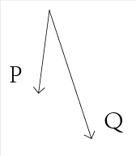
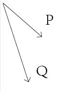

#学习总结-几何.向量叉积

>假设有向量$P(x1, y1)$和$Q(x2, y2)$
那么向量$P$和$Q$的叉积表示为$P×Q$
并且$P×Q= x1 * y2 - x2 * y1$

叉积的性质：
一个非常重要性质是可以通过它的符号判断两矢量相互之间的顺逆时针关系：
若 $P × Q > 0$, 则P在Q的顺时针方向;
若 $P × Q < 0$, 则P在Q的逆时针方向;
若 $P × Q = 0$, 则P与Q共线，但可能同向也可能反向.

·顺时针

·逆时针

应用，给出一个序列的点，判断它是顺时针还是逆时针：计算连续两个点的叉积，包括第一个和最后一个，求他们的和，大于0为顺时针，小于0为逆时针。

