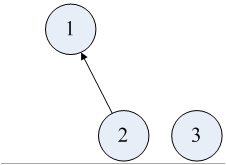
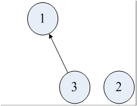
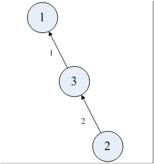
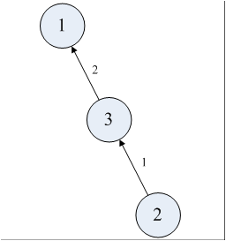
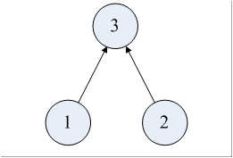
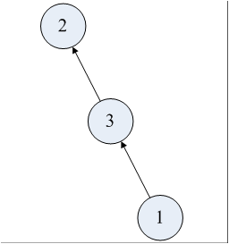

学习总结--数学.cayley定理

####定义：
> 有n个标志节点的树的数目等于$n^{n-2}$(仅是cayley在组合数学中的应用)

####简单证明：
> 1.首先我们假设n为4，即有3个节点
2.这样的话我们就有k个子树，此时k=3
(图1)
3.选中其中一个节点$C\binom{1}{n}$,然后让选中不含该节点的一个子树$C\binom{1}{k-1}$,让这颗子树的根连接到该节点上，这样的话子树就减少了一棵
(图2)
(图3)
等。。。

> 4.重复操作直到k=1，k从n变成1总共执行了n-1次，所以根据乘法原理，构造出的有确定根节点的树有$ans = n^{n-1}*(n-1)!$
5.但是对于一棵树来说，它又n-1条边，每条边被选中先后的顺序有$(n-1)!$种，但是对于树来说，边的先后关系是无关紧要的，所以$ans = \dfrac{ans}{(n-1)!}=n^{n-1}$
(图4)
(图5)
6.然后对于每个树来说，构造树时有确定根节点，每一个树可以将该树中的n个节点均做为根节点，于是乎$ans = \dfrac{ans}{n}=n^{n-2}$
(图6)
(图7)
(图8)